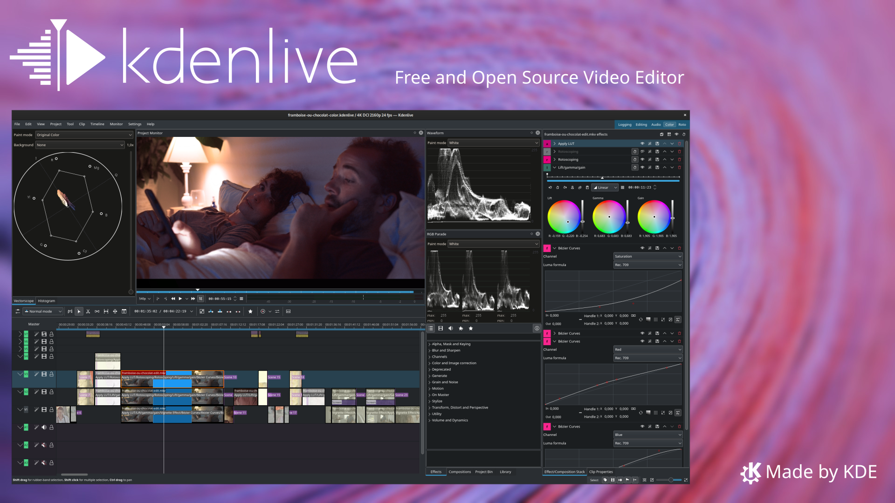
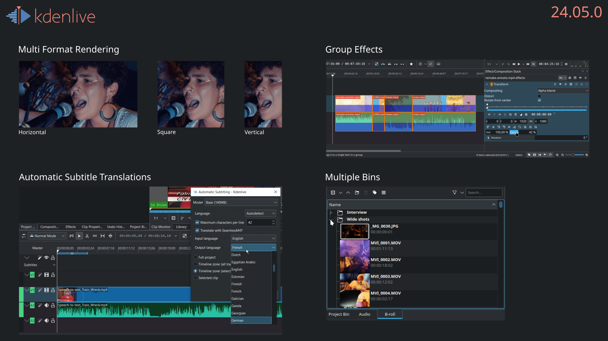
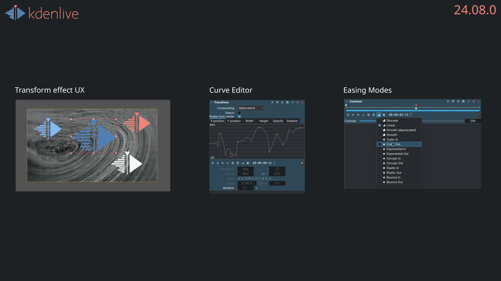
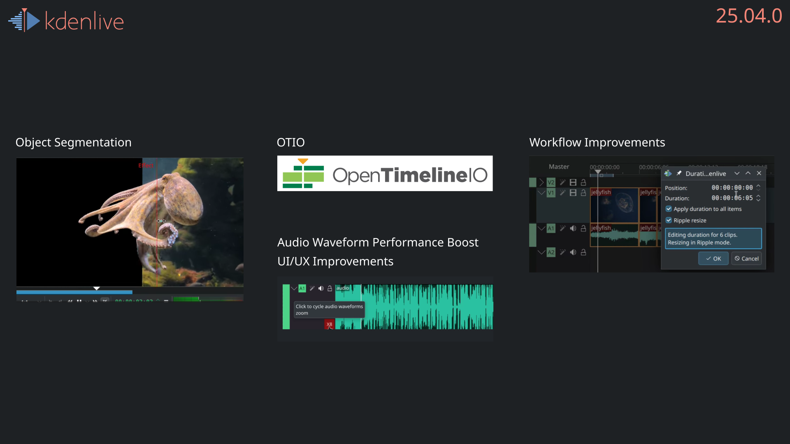
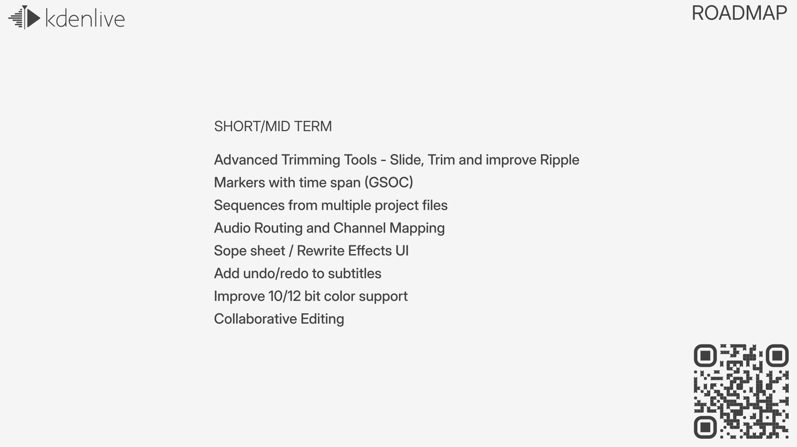

## Slide 0

Kdenlive is a powerful video editor made by the KDE community. 

### Further links

- Website: <https://kdenlive.org>
- Dicussion: <https://discuss.kde.org/tag/kdenlive>
- Code: <https://invent.kde.org/multimedia/kdenlive>
- Chat: <https://matrix.to/#/#kdenlive:kde.org>

---

## Slide 1 - Release 1 

Speakers Notes:  
Kdenlive had 4 major releases in the last year followed by monthly bug fix releases. 24.05 is the first release after the Qt6 upgrade. It reimplements the Audio Capture feature and focuses on enhancing stability while introducing a few exciting new features like Group Effects and Automatic Subtitle Translations. 

---

## Slide 2 - Release 2

Speakers Notes:  
24.08 came with nifty new features, enhancements, and quality-of-life improvements, specially for Effects and Transitions. 

---

## Slide 3 - Release 3

Numerous crashes and glitches have been addressed, including issues with audio capture, effect zones, high DPI display rendering, and subtitle editing. 

---

## Slide 4 - Release 4

Speakers Notes:  
25.04 is the latest and most stable Kdenlive release and is a great foundation for the upcoming new features.

---

## Slide 5 - Roadmap

Speakers Notes:  
In the last year Kdenlive got 2 news developers to the team. They also participated in a Season of KDE mentorship program and have an upcoming Google Summer of Code project. The team is planning a sprint and community meeting in Berlin in September during Akademy. Short and mid term roadmap features include:

---
