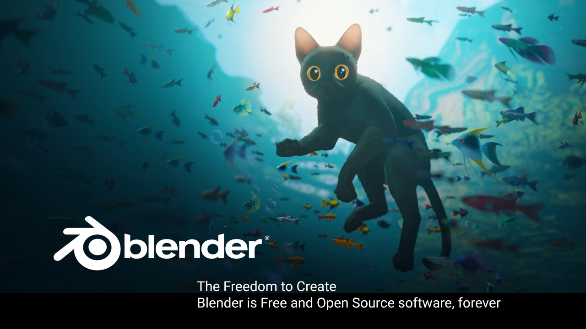
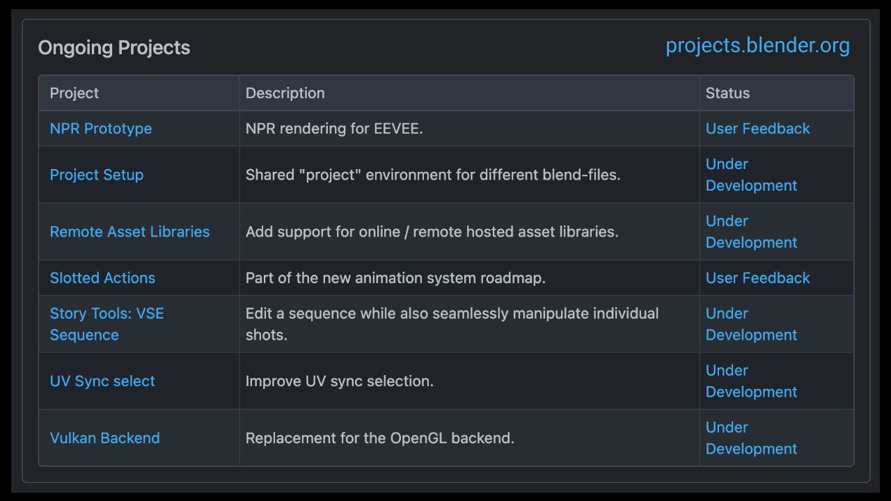

# Blender

---

## Slide 0

Blender is a community project coordinated by the Blender Foundation, primarily funded by donations.

Mission: Get the world’s best 3D CG technology in the hands of artists as free/open source software.

### Further links

- Website: <https://blender.org>
- Development Blog: <https://code.blender.org>
- Discussion: <https://devtalk.blender.org>
- Code: <https://projects.blender.org>

---

## Slide 1 - Ongoing Projects

Speakers Notes:

These are the ongoing projects aimed at Blender 4.5 in July or 5.0 later this year.

On top of this there is a lot of activity happening in the modules.
Those are usually the entry point for community contributions.

---

## Slide 2 - Reel

Speakers Notes:
[Blender 4.4 Showcase Real](https://www.youtube.com/watch?v=TQElJP1AaS0)

