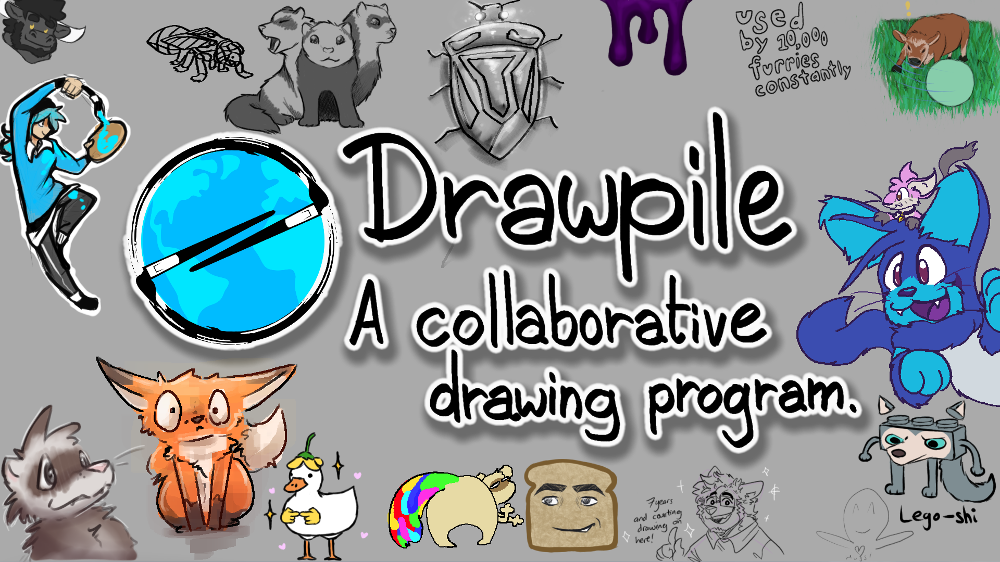
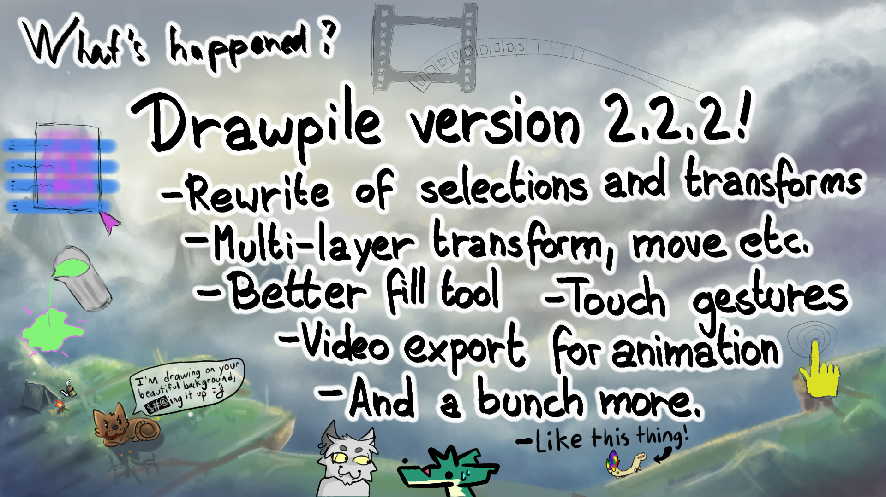
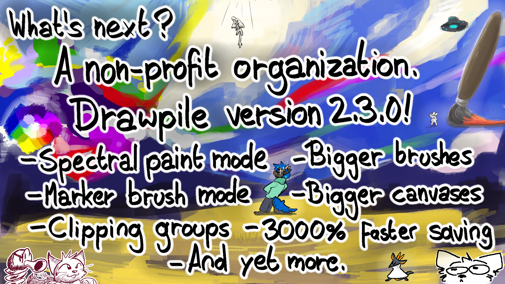

# Drawpile

---

## Slide 0

(Or use `drawpile-0.mp4` for a timelapse.)

Drawpile - a collaborative drawing program. Lets multiple artists draw, sketch, paint and animate on the same canvas together.

### Further links

- Website: <https://drawpile.net/>

---

## Slide 1 - Changelog

(Or use `drawpile-1.mp4` for a timelapse.)

Speakers Notes:

* Drawpile version 2.2.2 with many new features.
* Selections and transforms were rewritten to be more persistent and less fiddly.
* Multi-layer operations, like transformations or moves.
* Touch gestures, like two-finger tap to undo or tap-and-hold for a color picker.
* Video exports for animations.
* Improved fill tool, a magic wand, sketch mode for layers and much more.

---

## Slide 2 - Roadmap

(Or use `drawpile-2.mp4` for a timelapse.)

Speakers Notes:

* A non-profit company to continue sustaining the project is just about founded.
* Drawpile 2.3.0 is in development with an alpha version ready for testing.
* It will bring spectral painting for more realistic color mixing.
* A marker brush mode that's also been ported to Krita.
* Bigger brushes and canvas sizes.
* Clipping groups, for people used to that flavor of alpha perserve.
* A new canvas file format, there'll be a talk about it on Friday.
* And again yet more.

---

## Presence at the LGM

- Carsten (askmeaboutloom)
- Talk "3000% Faster File Saving With Time Travel" on Friday, 16:50: <https://libregraphicsmeeting.org/2025/program/3000-pct-faster-file-saving-with-time-travel/>
