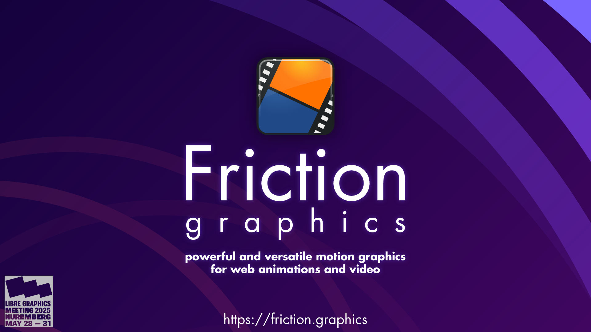
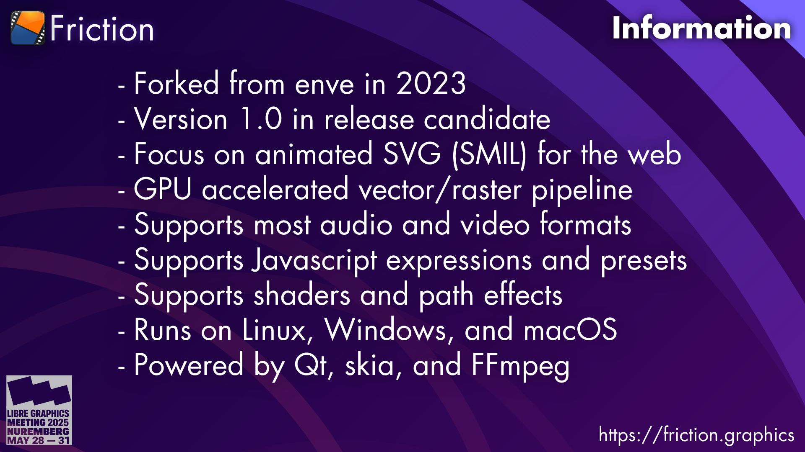
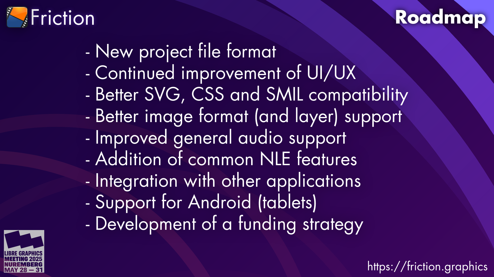
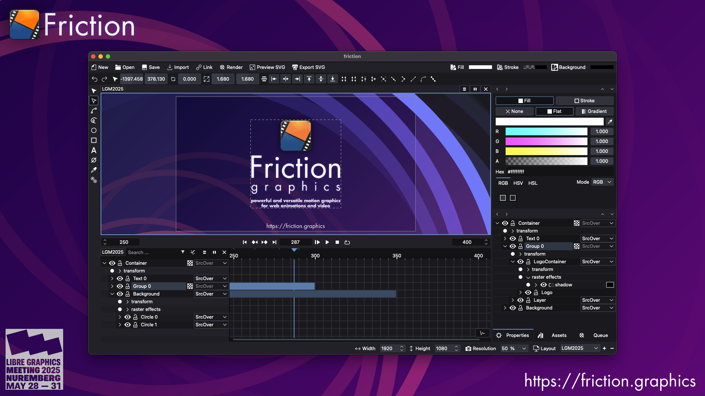
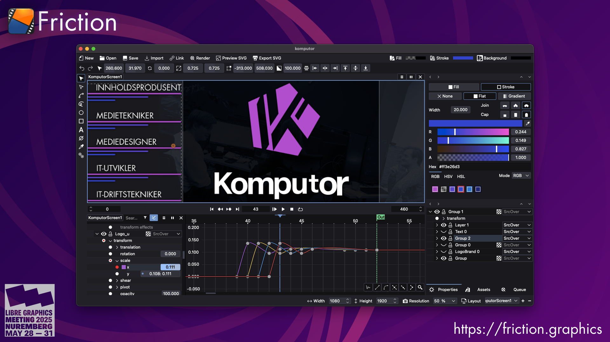
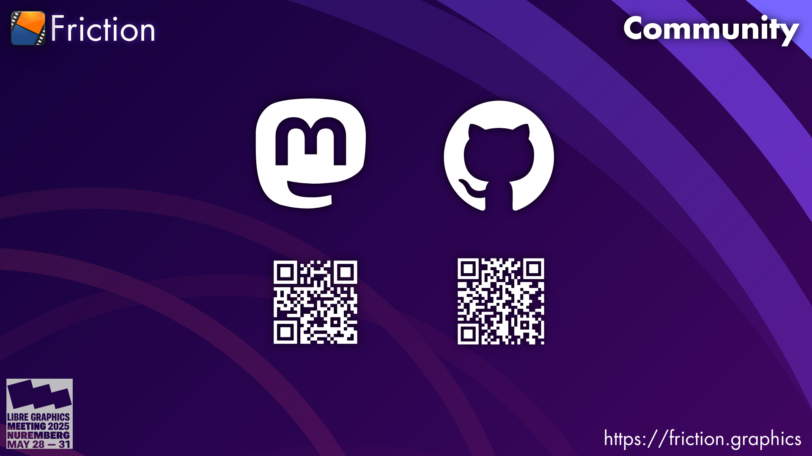

# Friction

## Slide 0

Friction is a powerful and versatile motion graphics application that allows you to create vector and raster animations for:

* **Television and film:** Title sequences, commercials, and visual effects
* **Web design:** Animated logos, banners, and interactive elements
* **Social media:** Animated posts and stories
* **Presentations:** Animated infographics and slideshows

### Further links

- Website: <https://friction.graphics>
- Community (links): <https://friction.graphics/community.html>
- Documentation: <https://friction.graphics/documentation/>

## Slide 1 - Changelog

Since this our first time on LGM this is a short introduction to Friction instead of a changelog:

- Forked from [enve](https://github.com/MaurycyLiebner/enve) in 2023
  - Forked by [Ole-André Rodlie](https://github.com/rodlie) in February 2023 for use at work
  - Currently used in production and education
- Version 1.0 in release candidate
  - RC2 should be available before LGM2025 starts
  - Final will be released sometime this summer
- Focus on [animated SVG (SMIL)](https://en.wikipedia.org/wiki/SVG_animation) for the web
- GPU accelerated vector/raster pipeline
  - Optimized for performance, will run on "low-end" hardware
- Supports most audio and video formats through FFmpeg
- Supports Javascript expressions and (user) presets
- Supports shaders (GLSL) and path effects
- Runs on Linux, Windows, and macOS (experimental)
- Powered by [Qt](https://www.qt.io/), [skia](https://skia.org), and [FFmpeg](https://ffmpeg.org/)

## Slide 2 - Roadmap

Our long and short term roadmap is:

- New project file format
  - Probably XML or SQLite
- Continued improvement of UI/UX
- Better SVG, CSS and SMIL compatibility
- Better image format (and layer) support
  - Will probably integrate OpenImageIO
- Improved general audio support and playback
- Addition of common NLE features
  - We want to include more NLE functionality
    - Mostly timeline related stuff
  - Support disk cache for previews/renders
    - Currently cache is limited by RAM
  - Color management using OpenColorIO and/or LCMS
- Integration with other applications
  - Inkscape
  - kdenlive
- Support for Android (tablets)
  - Custom TUI (touch user interface) for tablets
- Development of a funding strategy
  - The project needs to figure out a way to stay sustainable (pay for development and maintenance)

## Slide 3 - Screenshot

## Slide 4 - Screenshot

## Slide 5 - Community

Join us on Mastodon and GitHub.

- https://floss.social/@friction
- https://github.com/friction2d/friction
