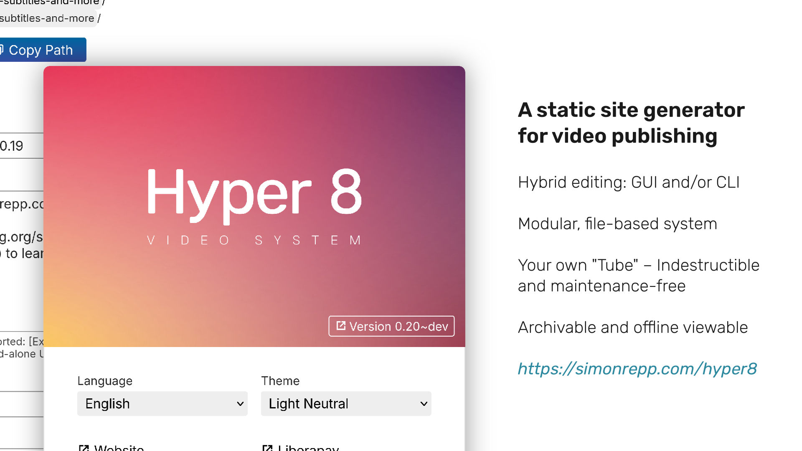
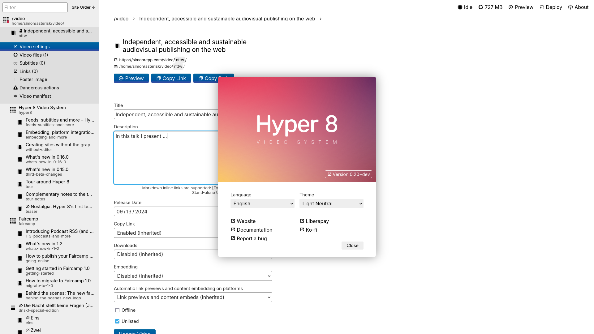
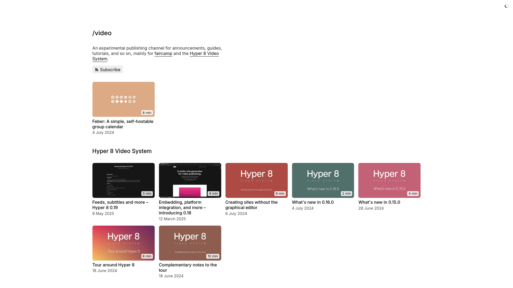
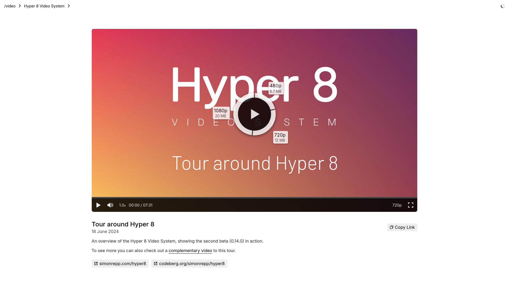

# Hyper 8 Video System

---

## Slide 0

The Hyper 8 Video System was first released in May 2024. It allows building
and publishing maintenance-free, static video sites of any size, and is
available for Windows, macOS and Linux.

### Further links

- Website: <https://simonrepp.com/hyper8>
- Repository: <https://codeberg.org/simonrepp/hyper8>
- Mastodon: <https://post.lurk.org/@freebliss>

---

## Slide 1 - Mission

The three core aims of the project are:

1. Independence:
   Enable publishing that's independent from big platforms or
   potentially fragile community infrastructure.

2. Accessibility:
   Provide a system that is usable for the widest audience possible,
   especially to those without a professional technical background.

3. Sustainability:
   Facilitate long-term availability of publications,
   especially in environments that are precarious in terms of financing,
   personal resources, or institutions involved.

---

## Slide 2 - Present

Hyper 8 already offers a solid foundation for video publishing, including,
for instance, support for subtitles, embeds, Atom and RSS feeds, platform
integration, theming, localization, and more.

---

## Slide 3 - Future

In the coming months Hyper 8 will be extended with built-in FTP deployment,
audio-only formats, transcripts, improved accessibility, refined design and
layouts, and most importantly, full desktop integration of the application.

---

## Presence at the LGM

Simon Repp (he), will be giving a whirlwind tour around the project in his talk on thursday:
https://libregraphicsmeeting.org/2025/program/hyper_8_video_system/
