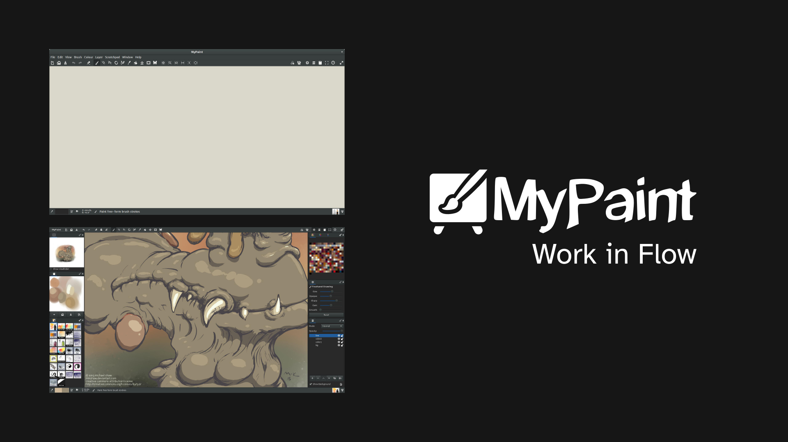
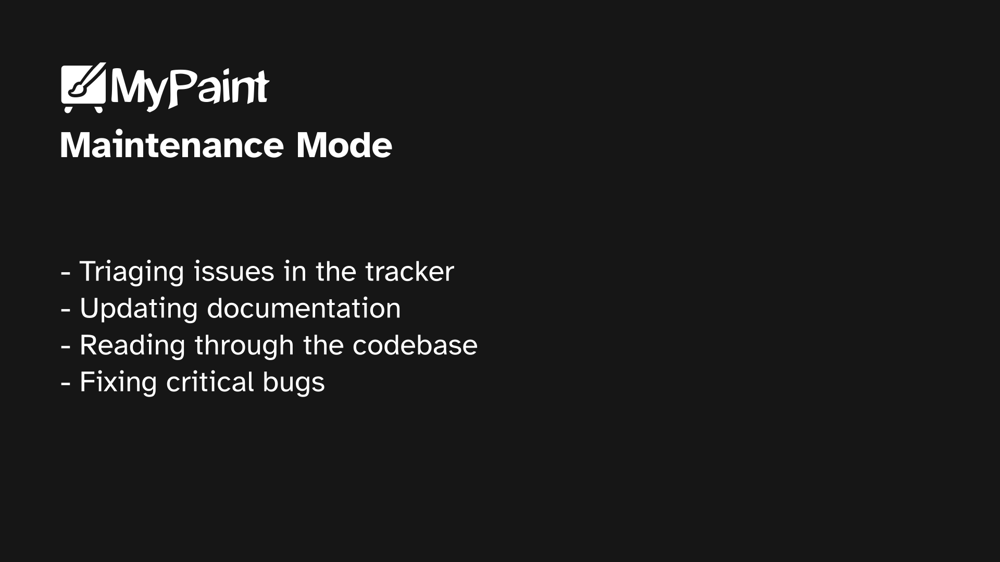
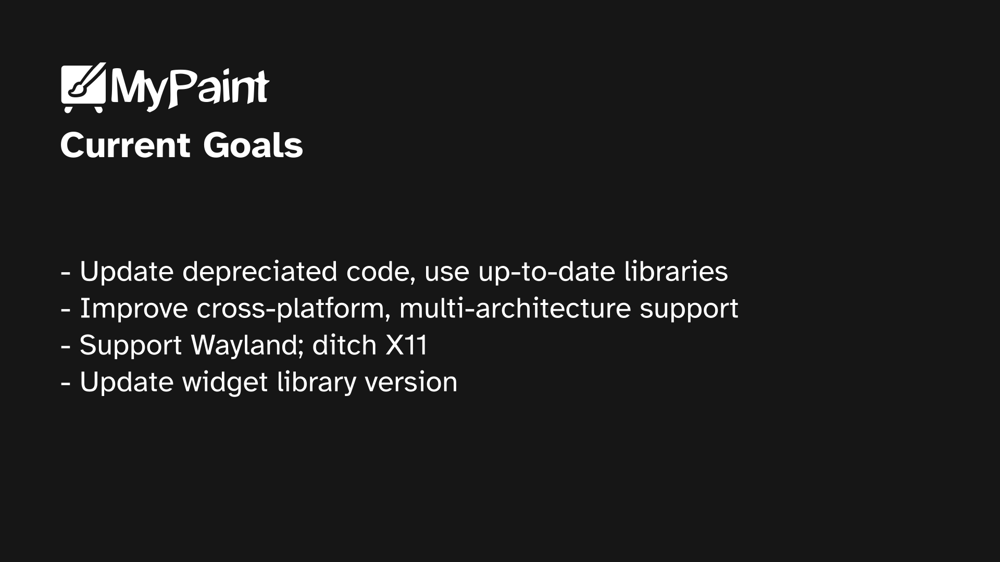

# MyPaint

> MyPaint is a rasterised digital painting software that uses the GTK toolkit and an in-house brush engine (adopted by several other softwares). From its inception, MyPaint was designed to be intuitive and simple to use, and is one of the most user-friendly FLOSS painting applications currently available on desktop.

## Maintenance mode

- The project's previous primary maintainer had stopped working on the project some time in 2021. The current maintainer picked up the project in 2024, and is working on the project in her free time, usually around the December-February period.
- With a three year gap between developers, the current maintainer has primarily worked on housekeeping:
    - Triaging issues in the tracker
    - Updating documentation
    - Reading through the codebase
    - Fixing critical bugs

## Current goals

- The current maintainer wishes to ensure that the codebase is free from depreciated code, and uses up-to-date libraries.
- No large feature updates planned in foreseeable future, but this may change.
- Maintenance targets:
    - Improve cross-platform and multi-architecture support, particularly macOS and ARM
    - Support Wayland; ditch X11
    - Update codebase to use latest version of GTK3, then migrate to GTK4
