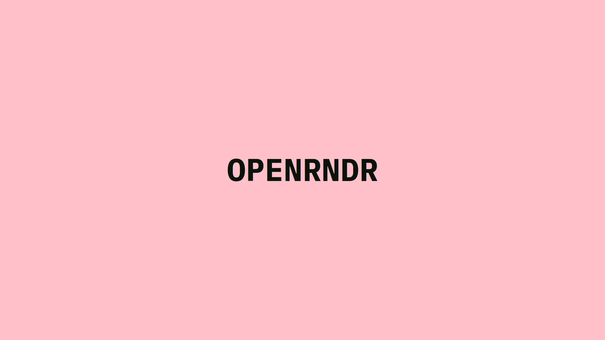
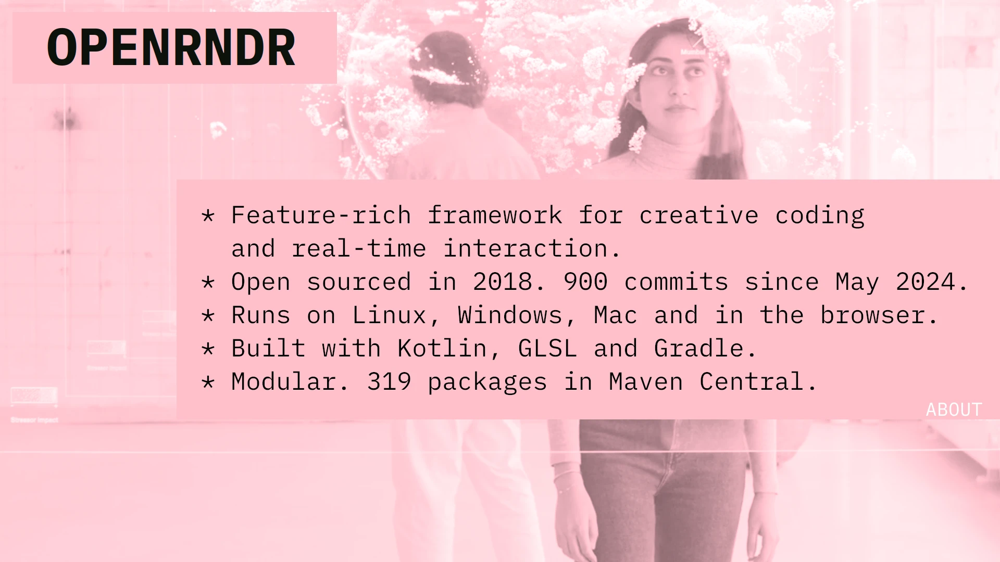
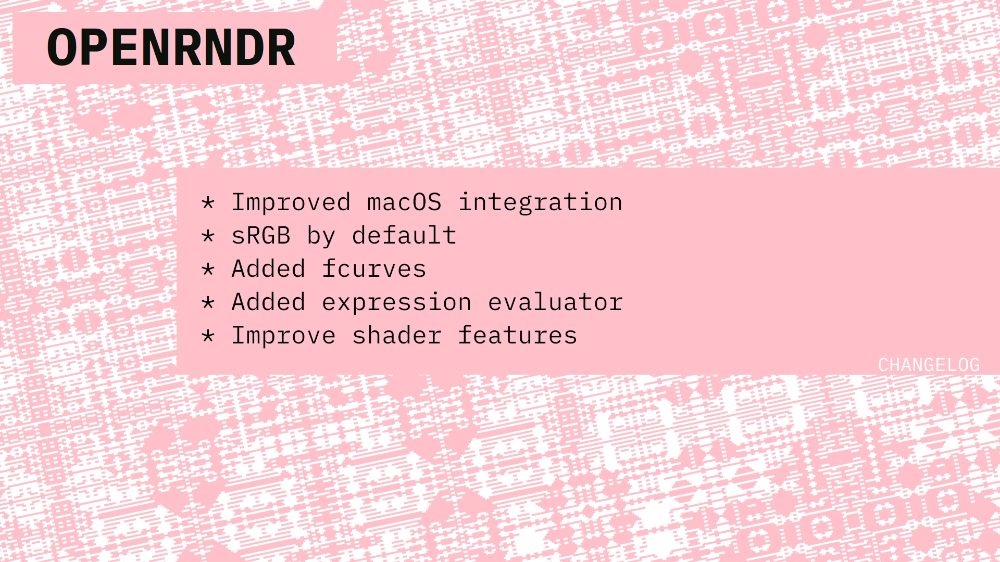
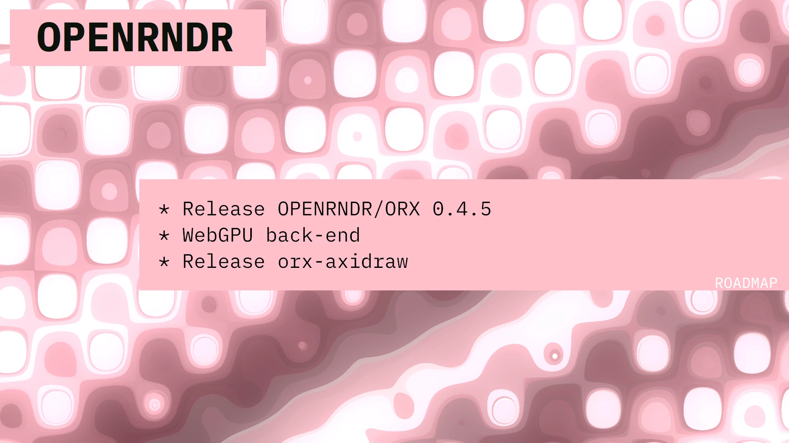

# OPENRNDR

---

## Slide 0

**Playful for prototypes. Serious for production.**

### Further links

- Website: <https://openrndr.org>
- Dicussion: <https://openrndr.discourse.group/>
- Code: <https://github.com/openrndr/>

---

## Slide 1 - About

- Feature rich FOSS framework for creative coding and real-time interaction.
- Runs on Linux, Windows, Mac and in the browser.
- Built with Kotlin, GLSL and Gradle.
- It is modular, featuring 319 packages in Maven Central.
- Open sourced in 2018. Over 900 commits since May 2024.

## Slide 2 - Changelog

- Support Apple ARM64 CPU via GLES and Angle.
- sRGB textures by default.
- Added [fcurves](https://github.com/openrndr/orx/tree/master/orx-fcurve).
- Added a mathematical string [expression evaluator](https://github.com/openrndr/orx/tree/master/orx-expression-evaluator).
- New [shader features](https://github.com/openrndr/orx/tree/master/orx-shade-styles): clipping, composition, gradients, image fills, noise and patterns.

---

## Slide 3 - Roadmap

- Release OPENRNDR/ORX 0.4.5
- WebGPU backend
- [orx-axidraw](https://github.com/openrndr/orx/pull/356)

---

## Presence at the LGM

- [Abe Pazos Solatie](https://hamoid.com) - Graphics and Creative Coding on the JVM. 
  BoF, Saturday 31st at 13:20.

