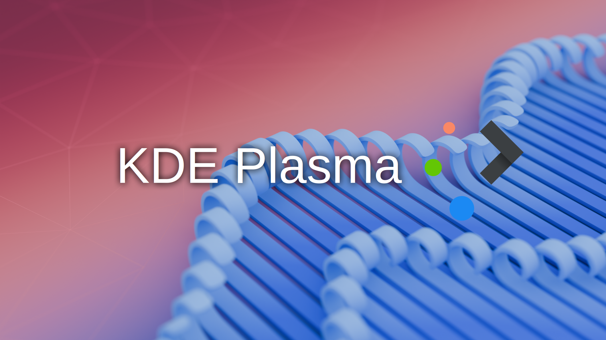
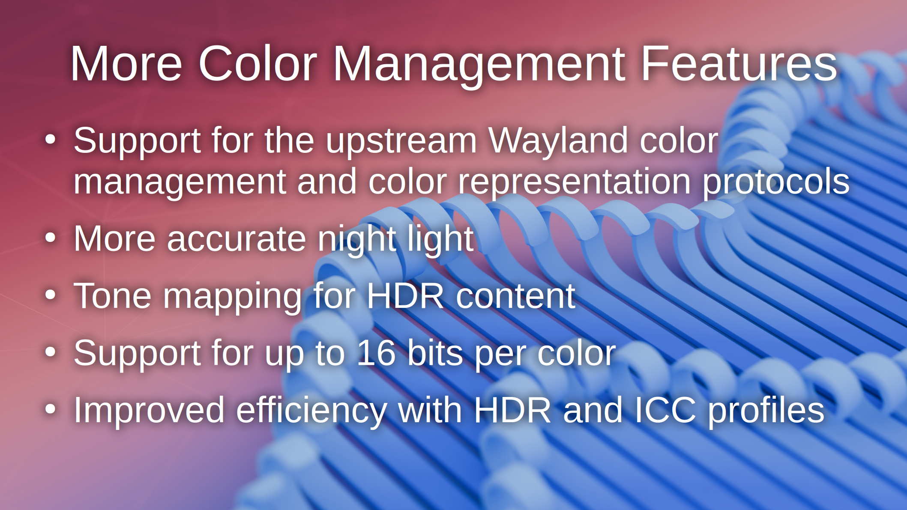
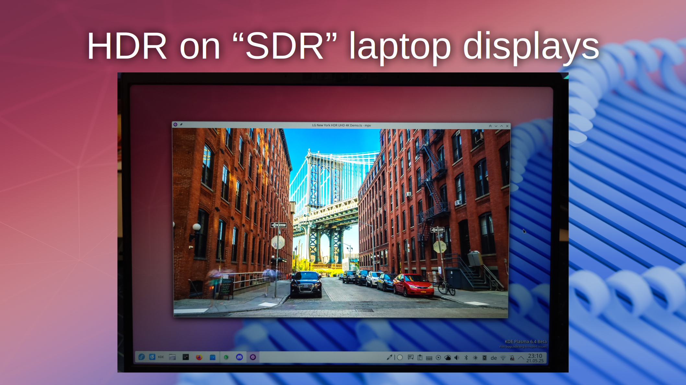

# Slide 1: KDE Plasma

KDE Plasma is a desktop environment for Linux. Plasma 6.3 released earlier this year, and the Plasma 6.4 release will be in June - both coming with a bunch improvements in tablet and graphics support.

# Slide 2: Improved tablet settings
- overhauled the tablet settings page
- customizing the stylus pressure curve is now possible
- allow rebinding stylus buttons to other stylus buttons
- ability to map a portion of the tablet to an area on the screen

# Slide 3: More color management features
- added support for upstream Wayland color management and color representation protocols, so apps can actually make use of HDR
- improved accuracy of night light by making it properly color managed, also making it look better
- implemented tone mapping for HDR content (mostly needed when viewing it on SDR screens, but in many cases it also helps on HDR displays)
- added support for outputting up to 16 bits per color
- improved efficiency a lot when HDR is enabled or an ICC profile is used

# Slide 4: Built-in HDR calibration tool
Some HDR displays don't provide brightness information, or even provide incorrect information. The calibration tool allows you to configure peak brightness and overall brightness levels.

# Slide 5: HDR on "SDR" laptop displays
By dynamically adjusting the backlight and adjusting software brightness mapping to match, viewing HDR content on normal laptop displays has become amazing.

# Slide 6: Future plans
- support for tablet dials
- nicely integrated display profiling application
- more hardware offloading of color management operations, for better performance and efficiency
- HDR support in Qt

