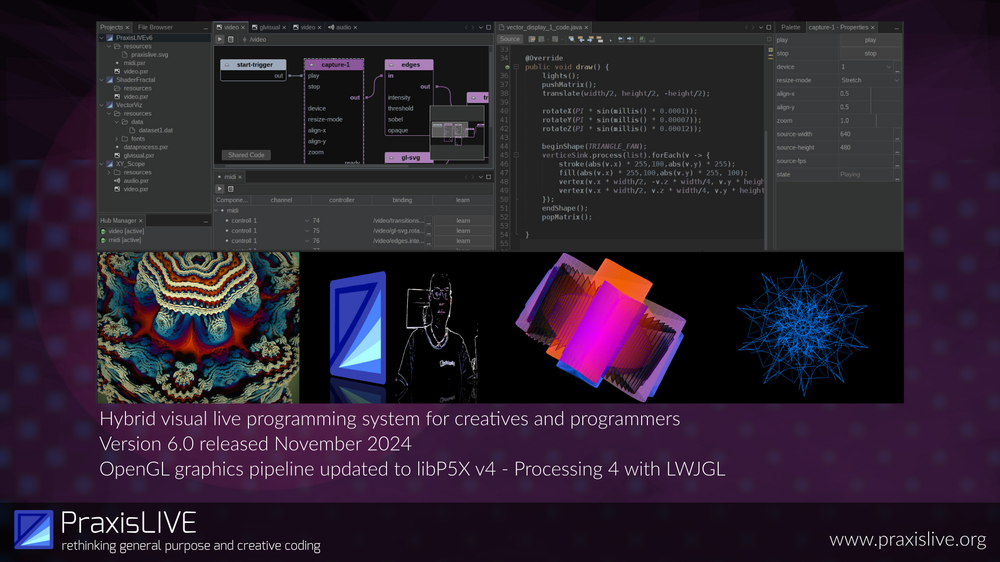
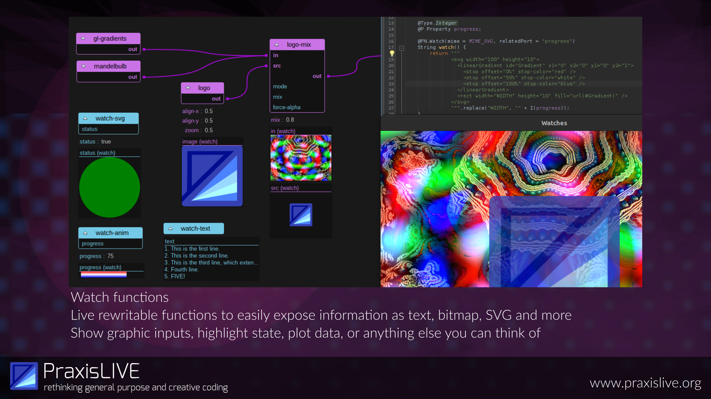
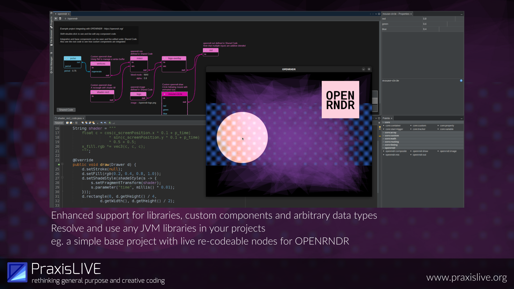

# PraxisLIVE

## Slide 0

PraxisLIVE is a hybrid visual live programming system, bringing aspects of Smalltalk, Erlang and Extempore into the Java world. It has a history and particular focus on creative coding and graphics, with built-in support for working with Processing, GStreamer video and OpenGL.

PraxisLIVE v6 was released in November 2024.

libP5X, the bundled Processing distribution with alternative LWJGL renderer, was updated to Processing v4.

## Slide 1

Live rewritable watch functions provide a new way to expose information about a running project. These currently support text, bitmaps or SVG. We can show graphic inputs, highlight state, plot data and more.

This is part of an ongoing focus on the moldability of the system.

## Slide 2

PraxisLIVE v6 enhanced support for working with libraries, defining base components, and passing any data types around the actor graph.

Resolve and use any JVM libraries in your projects.

For example, this slide shows a simple base project providing a live re-codeable node graph for OPENRNDR.

