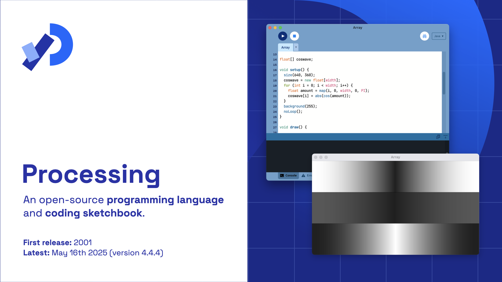
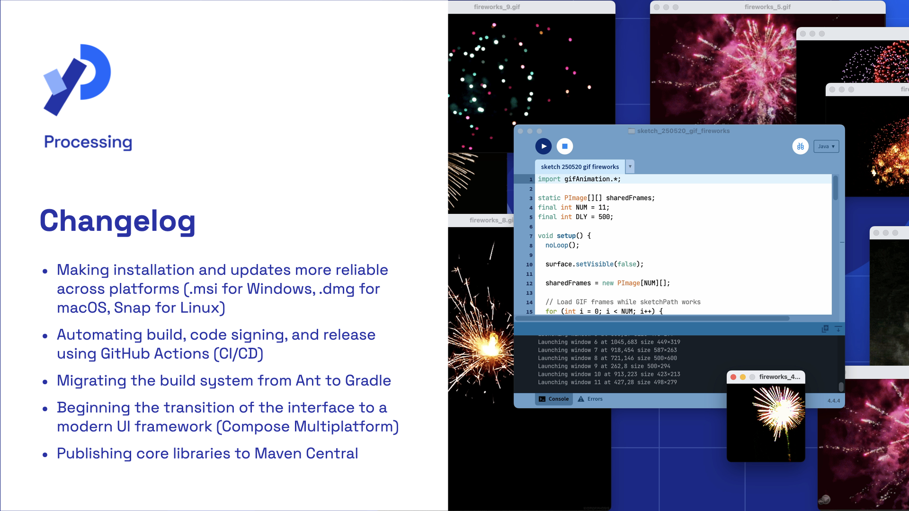
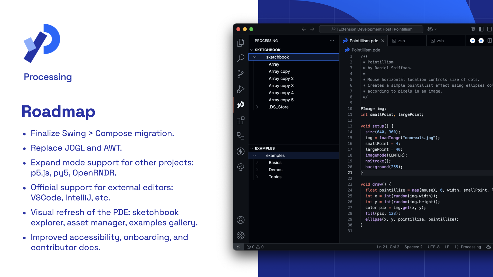
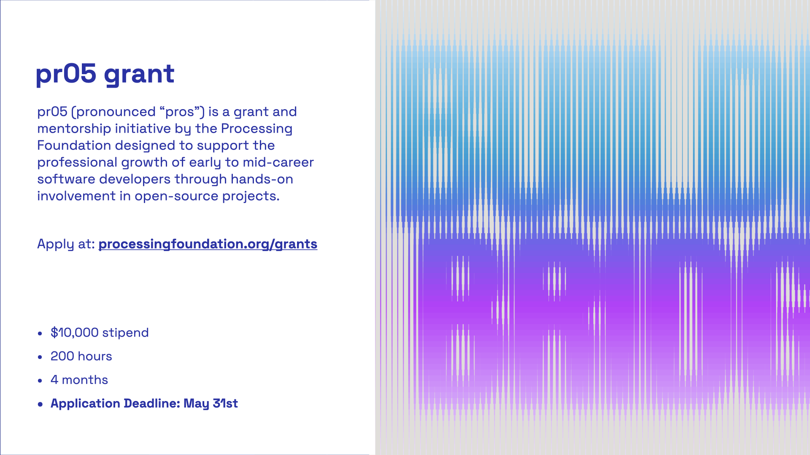

# Processing

## Slide 0 - What Is Processing?

Processing is an open-source programming environment designed to make coding accessible for artists, designers, students, and educators. Launched in 2001, it’s  a language, a minimal development environment, and a community that helps people learn how to code through visual and interactive projects. Today, it’s used in classrooms to art studios—for creative exploration, prototyping, and teaching programming fundamentals.Processing was originally created by Casey Reas and Ben Fry at MIT Media Lab. It is maintained by the Processing Foundation and the Processing community.

- Website: https://processing.org  
- Code: https://github.com/processing/processing4  
- Community: https://discourse.processing.org

---

## Slide 1 - Changelog 2024–2025

Since early 2024, with support from the Processing Foundation, our two-person team resumed active development on Processing. Our main challenge was to reconstruct knowledge of the codebase without a formal handover from the previous maintainer.

---

## Slide 2 - Roadmap

---

## Slide 3 - pr05 

This year will be the second edition of pr05 (pronounced “pros”), a grant and mentorship initiative by the Processing Foundation. This program supports the professional growth of early to mid-career software developers through hands-on involvement in open-source projects. Applications are open until **May 31, 2025**.

Learn more and apply at: https://processingfoundation.org/grants

---

## Presence at LGM

- Raphaël de Courville (Processing Community Lead)
- Stef Tervelde (Processing core developer)