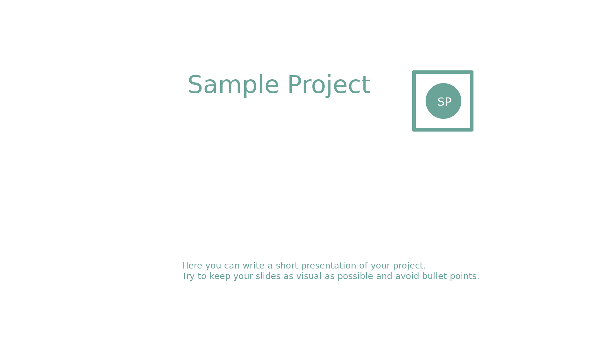
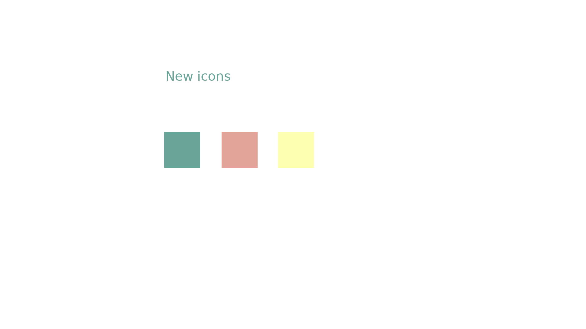

# Sample project

- Name of project, project logo/branding, and a short one or two sentence description of the project.
- A title slide/hero shot and/or picture of the software in use, preferably size 1920x1080.
    - If feel the need for more images to include in the presentatin, feel free.
- Changes/changelog in the last year, and plans for the future.
- Speaker notes for any additional information or specifications you want me to say.

This file will contain the speaker's notes.

The speaker's notes should provide to the speaker the information to fill about 60 to 90 seconds.

Please, replace the content of this file with the information about what happened in your project since the last LGM.

---

## Slide 0

Introductory Slide: Just an image (Logo and or general screenshot, ...)

A short one or two sentence description of the project

### Further links

- Website: <http://sample-project.org>
- Dicussion: <http://sample-project.org>
- Code: <http://sample-project.org>

---

## Slide 1 - Changelog

Speakers Notes:  
Tell what your project did last year and what cool things you've accomplished.

---

## Slide 2 - Roadmap

Speakers Notes:  
Tell what are your project's plans for the future.

---

## Presence at the LGM

If you're at the LGM please list the project's people (names or number of) who are present at the LGM and the talks / activities that you will be proposing.

- Person 1
- Person 2
