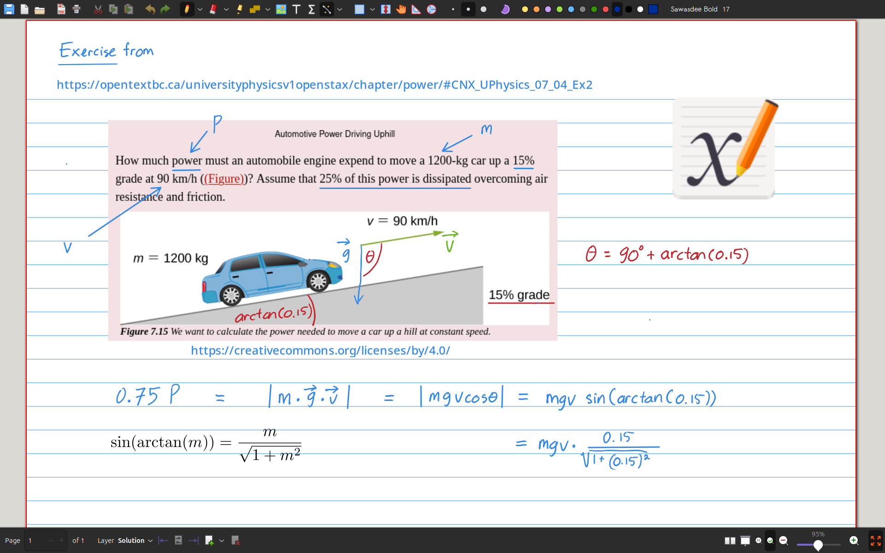
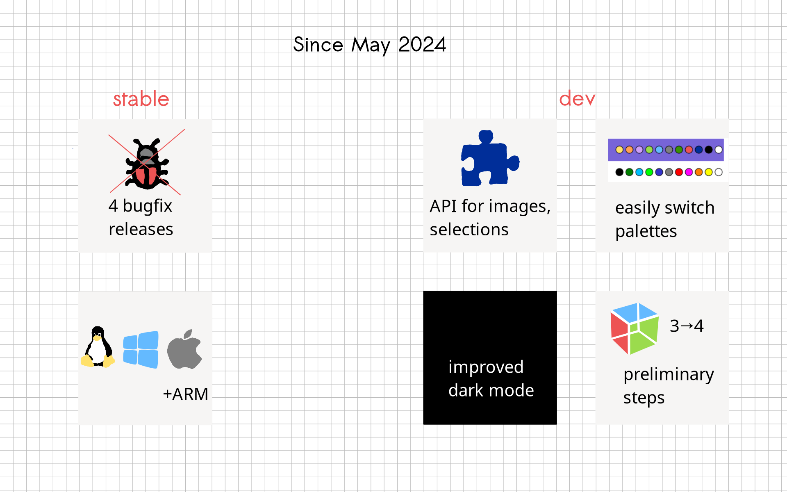
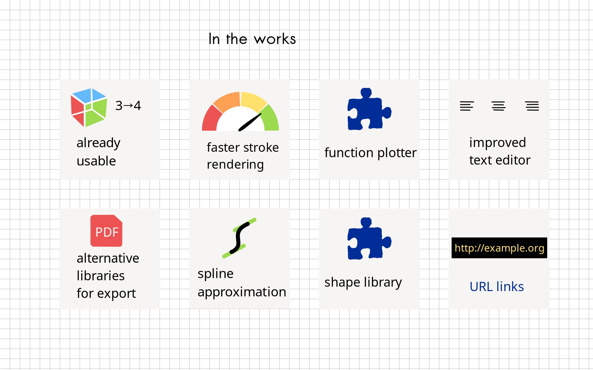

# Xournal++

---

## Slide 0

- Xournal++ is a free and cross-platform note-taking software that is fast, flexible, and functional. A modern rewrite and a more feature-rich version of the wonderful Xournal program.

### Further links

- Website: <https://xournalpp.github.io>
- Dicussion: <https://github.com/xournalpp/xournalpp/discussions>
- Code: <https://github.com/xournalpp/xournalpp>

---

## Slide 1 - Changelog

Speakers Notes:
- 4 bugfix releases (1.2.4 - 1.2.7) have appeared, improving user experience on various platforms, and adding a MacOS ARM build
- The development version (nightly build) is based on 1.2.0, includes the bugfixes from the 1.2.x series and adds features towards 1.3.0.

---

## Slide 2 - Roadmap

Speakers Notes:
- A lot of work is going into developing a working Gtk 4 version of Xournal++
- Alternative libraries for PDF exports like QPDF/PoDoFo allow preserving PDF features like annotations and forms
